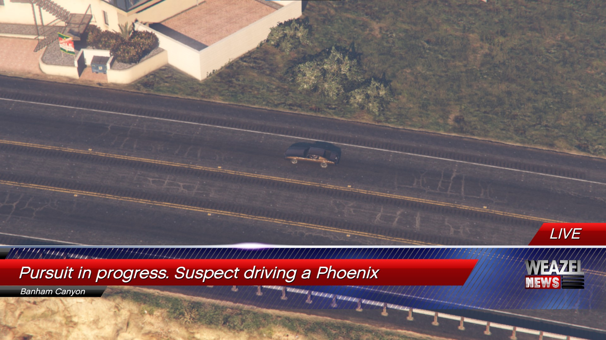
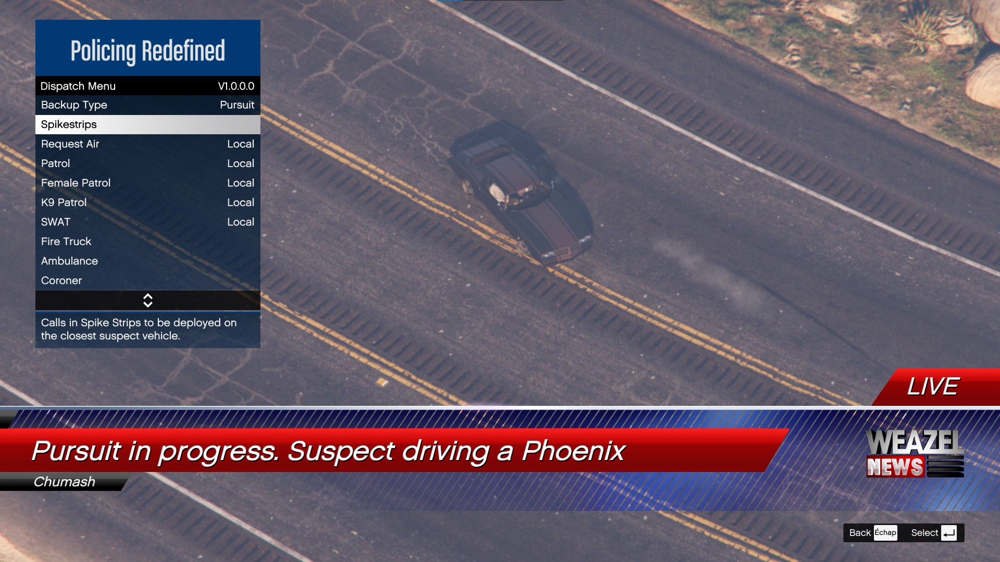
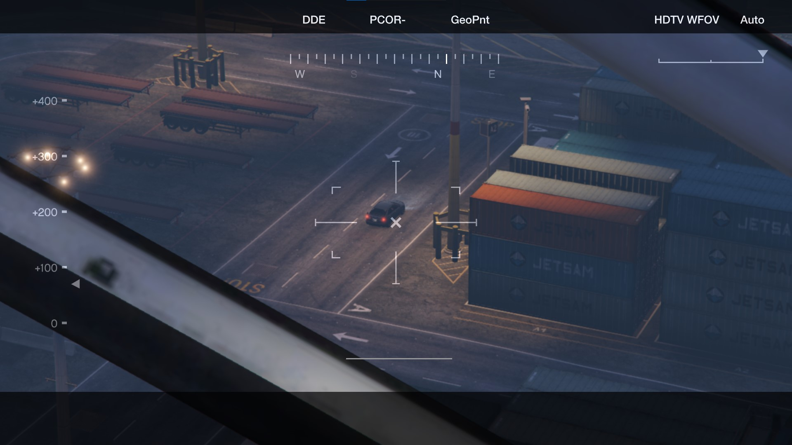
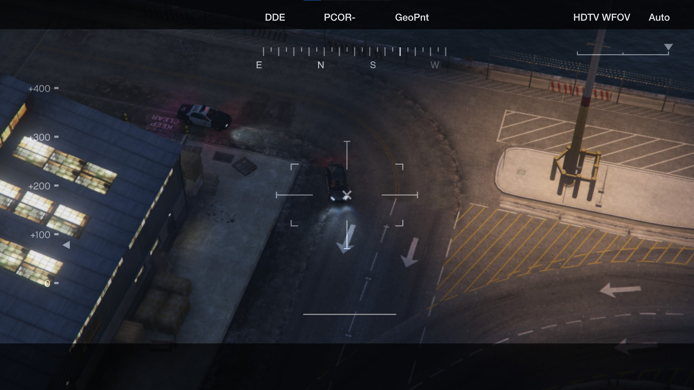
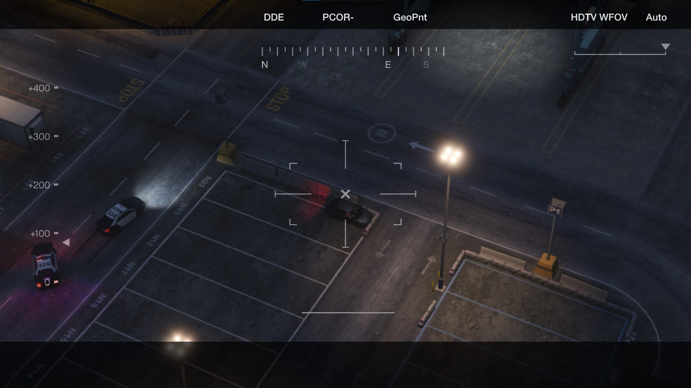

# HeliView - *LSPDFR Plugin*

An LSPDFR plugin to switch to aerial view during a chase. Either with a police helicopter or a news channel helicopter.  
Included in [Yasd's NewsHeli plugin (lcpdfr.com)](https://www.lcpdfr.com/downloads/gta5mods/scripts/51090-newsheli/).  
A standalone version is available in the [Releases](https://github.com/SSStuart/HeliView_LSPDFRPlugin/releases/latest). *(Only use one of the two versions.)*

## How it works
During a pursuit, press `CTRL` + `R` to switch to helicopter view. Press again to exit, or use `CTRL` + `SHIFT` + `R` to switch to another suspect. 

## Configuration
You can adjust some settings in the `.ini` file :
- If an overlay should be displayed when in the helicopter view.
- If the player character should be warped in the helicopter.
- The type of helicopter (cop or news team).
<table>
  <tr>
    <td></td>
    <td></td>
    <td></td>
  </tr>
  <tr>
    <td></td>
    <td></td>
    <td></td>
  </tr>
</table>

## `ℹ` Prerequisites
- [RAGE Plugin Hook](https://ragepluginhook.net/Downloads.aspx)
- [LSPDFR](www.lcpdfr.com/lspdfr/)
- [LucasRitter.Scaleforms](https://github.com/LucasRitter/gtav-scaleforms/releases/tag/0.1.0)
